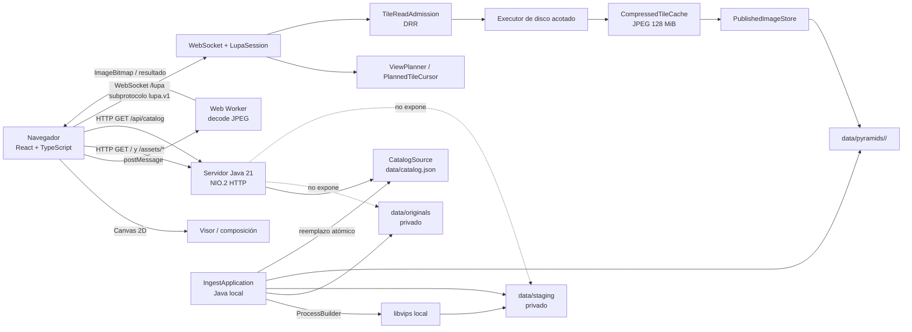

# I22 — Arquitectura implementada

**Fecha:** 23 de septiembre de 2026  
**Base validada:** `f5dee50`

Este archivo actualiza la arquitectura técnica sin modificar
`Avances_LUPA.docx`, que se conserva como antecedente de diseño.

## Diagrama

## Responsabilidades

### Navegador

- interfaz React;
- selección de imagen;
- navegación, zoom, detalle y foco;
- Canvas 2D;
- WebSocket nativo;
- ledger de entregas y STA;
- presupuesto de bitmaps administrado por LUPA.

### Worker

- recibe el payload TILE desde el cliente;
- decodifica JPEG fuera del hilo de interfaz;
- devuelve resultado terminal para composición o descarte;
- no accede a servicios externos.

### Java HTTP/NIO.2

- `AsynchronousServerSocketChannel` acepta TCP;
- HTTP sirve frontend local y catálogo;
- `/lupa` realiza Upgrade WebSocket;
- callbacks de red no ejecutan lectura pesada de disco.

### Sesión LUPA

- HELLO/WELCOME;
- OPEN/MANIFEST;
- VIEW/PLAN;
- TILE/DONE;
- épocas y cancelación;
- créditos;
- STA (`ACK_STATE`);
- heartbeat/timeouts;
- cleanup y reconexión.

### Planificación y recursos

- `ViewPlanner` decide niveles y región;
- `TileReadAdmission` arbitra sesiones mediante DRR;
- executor de disco realiza lecturas publicadas;
- caché comprimida global está acotada por bytes;
- buffers de salida tienen presupuesto separado.

### Importación y publicación

- el administrador ejecuta `IngestApplication` localmente;
- Java invoca libvips por `ProcessBuilder`;
- originales y staging permanecen privados;
- solo versiones completas pasan a `pyramids`;
- el catálogo cambia de forma atómica;
- el servidor ya ejecutándose descubre el catálogo nuevo en la siguiente lectura de
  `/api/catalog`.

## Protocolos por enlace

| Enlace | Mecanismo |
|---|---|
| Navegador → página/assets | HTTP local |
| Navegador → catálogo | HTTP local |
| Navegador ↔ sesión LUPA | WebSocket RFC 6455 / `lupa.v1` |
| UI ↔ Worker | `postMessage` local del navegador |
| Servidor → catálogo/manifiestos/teselas | acceso local a archivos |
| Importador → libvips | proceso local |
| Importador → originals/staging/pyramids/catalog | acceso local a archivos |

No existe conexión de red desde Java hacia libvips ni dependencia de CDN/API externa
en el recorrido de producción validado por I22.
